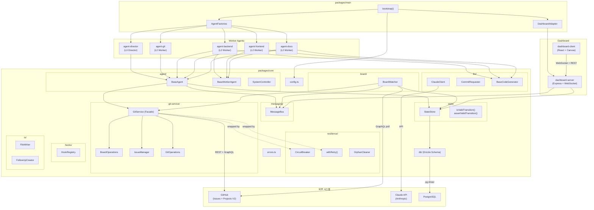
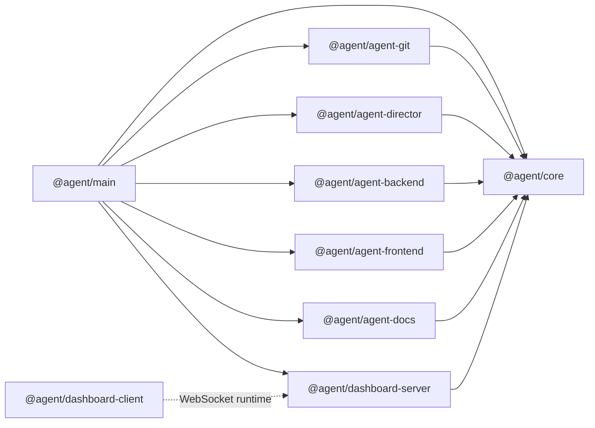
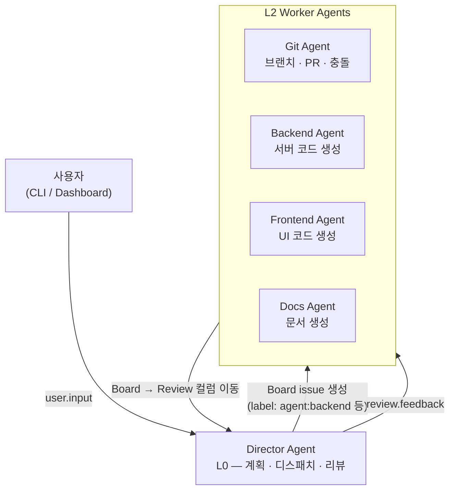
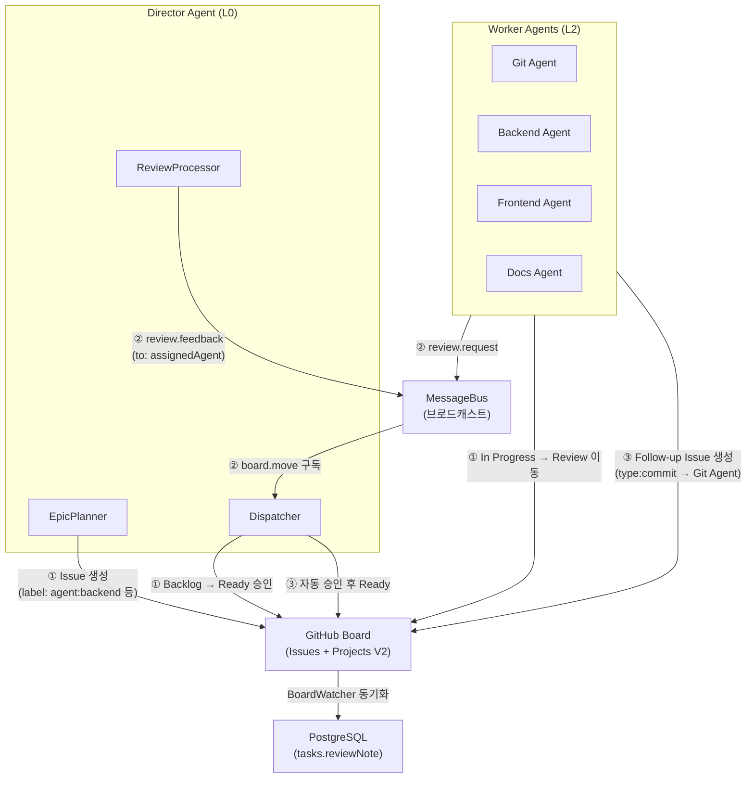
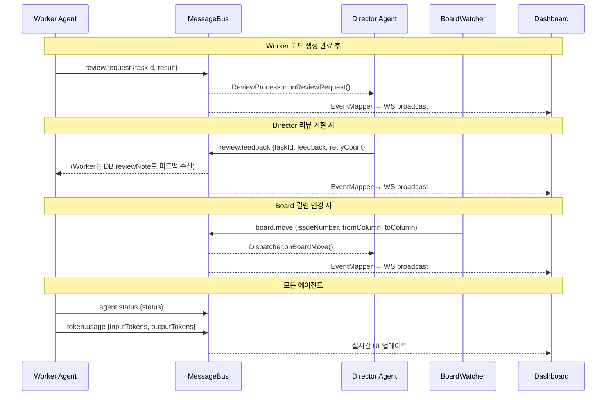
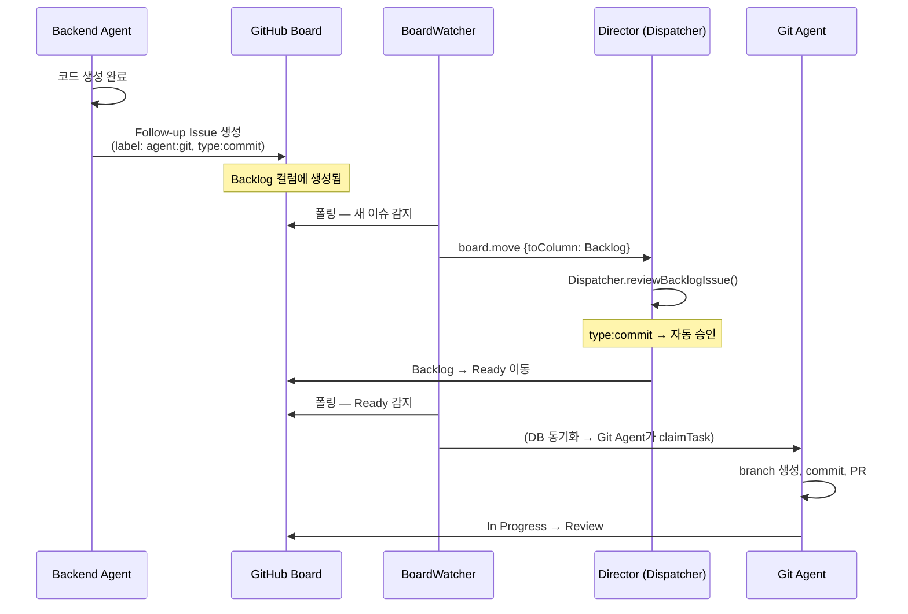

# System Architecture

## 전체 시스템 구조

## 패키지 의존성 그래프

## 에이전트 계층 구조

## 에이전트 간 상호작용

### 통신 경로 3가지

에이전트끼리 직접 메서드를 호출하지 않는다. 모든 상호작용은 아래 3가지 간접 경로를 통한다.

### 경로 1 — Board 기반 태스크 할당

| 단계 | 발신 | 수신 | 매체 | 설명 |
|------|------|------|------|------|
| 태스크 생성 | EpicPlanner | Worker (간접) | GitHub Issue + `agent:*` label | Worker는 DB에서 자기 label 태스크만 폴링 |
| Ready 승인 | Dispatcher | Worker (간접) | Board 컬럼 이동 Backlog→Ready | BoardWatcher가 DB 동기화 → Worker가 claimTask() |
| 완료 보고 | Worker | Director (간접) | Board 컬럼 이동 In Progress→Review | + review.request MessageBus 발행 |
| 리뷰 승인 | ReviewProcessor | - | Board 컬럼 이동 Review→Done | + 의존성 체인 트리거 (checkAndPromoteDependents) |
| 리뷰 거절 | ReviewProcessor | Worker (간접) | Board 컬럼 이동 Review→Ready | + DB reviewNote에 피드백 저장, review.feedback 발행 |

### 경로 2 — MessageBus 이벤트

| 메시지 타입 | 발행자 | 구독자 | 용도 |
|------------|--------|--------|------|
| `board.move` | BoardWatcher | Dispatcher, Dashboard | 컬럼 변경 감지 → 의존성 승인, Backlog 검토 |
| `board.remove` | BoardWatcher | Dashboard | Board에서 이슈 삭제 감지 → 대시보드 알림 |
| `review.request` | BaseAgent (Worker) | ReviewProcessor, Dashboard | 코드 리뷰 요청 |
| `review.feedback` | ReviewProcessor | Dashboard (Worker는 DB로 수신) | 리뷰 피드백 전달 |
| `agent.status` | 모든 에이전트 | Dashboard | 에이전트 상태 표시 |
| `token.usage` | 모든 에이전트 | Dashboard | 토큰 사용량 추적 |
| `epic.progress` | EpicPlanner | Dashboard | 에픽 진행률 표시 |
| `user.input` | CLI / Dashboard | DirectorAgent | 사용자 명령 전달 |
| `agent.config.updated` | Dashboard REST API | BaseAgent (hot-reload) | 에이전트 설정 변경 |

### 경로 3 — Follow-up Issue (도메인 간 작업 요청)

Worker가 작업 중 다른 도메인의 작업이 필요하면 GitHub에 follow-up issue를 생성한다.
Worker끼리 직접 통신하지 않고, Board를 통해 간접적으로 협업한다.

**Follow-up 타입:**

| 타입 | 대상 에이전트 | 설명 |
|------|-------------|------|
| `commit` | Git Agent | 생성된 코드를 branch + commit + PR |
| `test` | Backend/Frontend Agent | 테스트 코드 작성 |
| `docs` | Docs Agent | API 문서, README 업데이트 |
| `api-hook` | Backend Agent | API 엔드포인트 연동 |
| `review` | Director | 수동 리뷰 요청 |

### 핵심 설계 원칙

1. **직접 통신 금지** — Worker↔Worker 직접 호출 없음. 모든 협업은 Board 또는 MessageBus 경유
2. **Board가 진실의 원천** — 태스크 상태는 Board가 최종 권한. BoardWatcher가 DB로 동기화
3. **Worker는 DB만 읽음** — `stateStore.getReadyTasksForAgent()`로 자기 태스크만 폴링. GitHub API 직접 호출 안 함
4. **MessageBus는 알림 전용** — 상태 변경은 Board/DB에서 수행. MessageBus는 이벤트 알림 + 감사 로그
5. **review.feedback는 이중 경로** — MessageBus로 브로드캐스트 (대시보드용) + DB `reviewNote`에 저장 (Worker가 재작업 시 참조)

## 데이터 흐름 요약

| 경로 | 방향 | 매체 |
|------|------|------|
| 사용자 → Director | CLI / Dashboard command bar | MessageBus (`user.input`) |
| Director → Worker | 태스크 할당 | GitHub Board (issue 생성 + label) |
| Worker → Director | 작업 완료 보고 | Board 컬럼 이동 (In Progress → Review) |
| Board → DB | 동기화 | BoardWatcher (15초 폴링) |
| Agent → DB | 태스크 읽기 | StateStore (`getReadyTasksForAgent`) |
| Agent ↔ Agent | 브로드캐스트 | MessageBus (`board.move`, `agent.status` 등) |
| Server → Client | 실시간 UI | WebSocket (DashboardEvent) |
