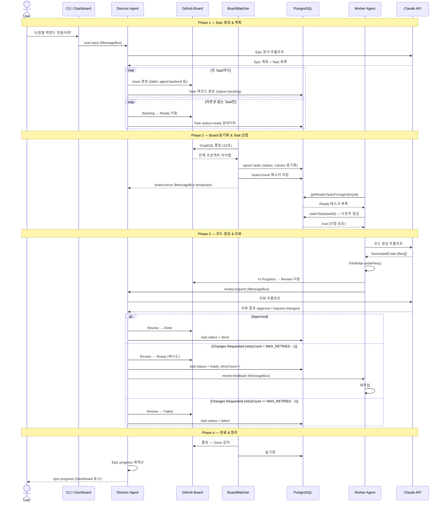
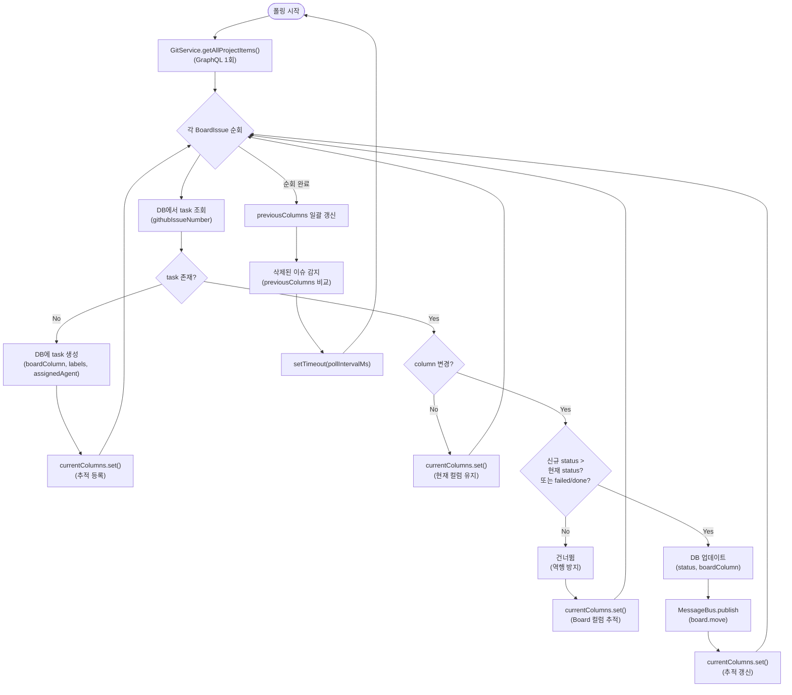
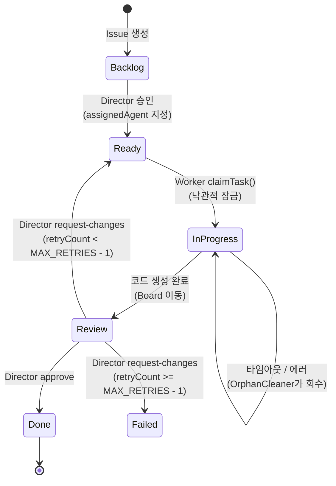
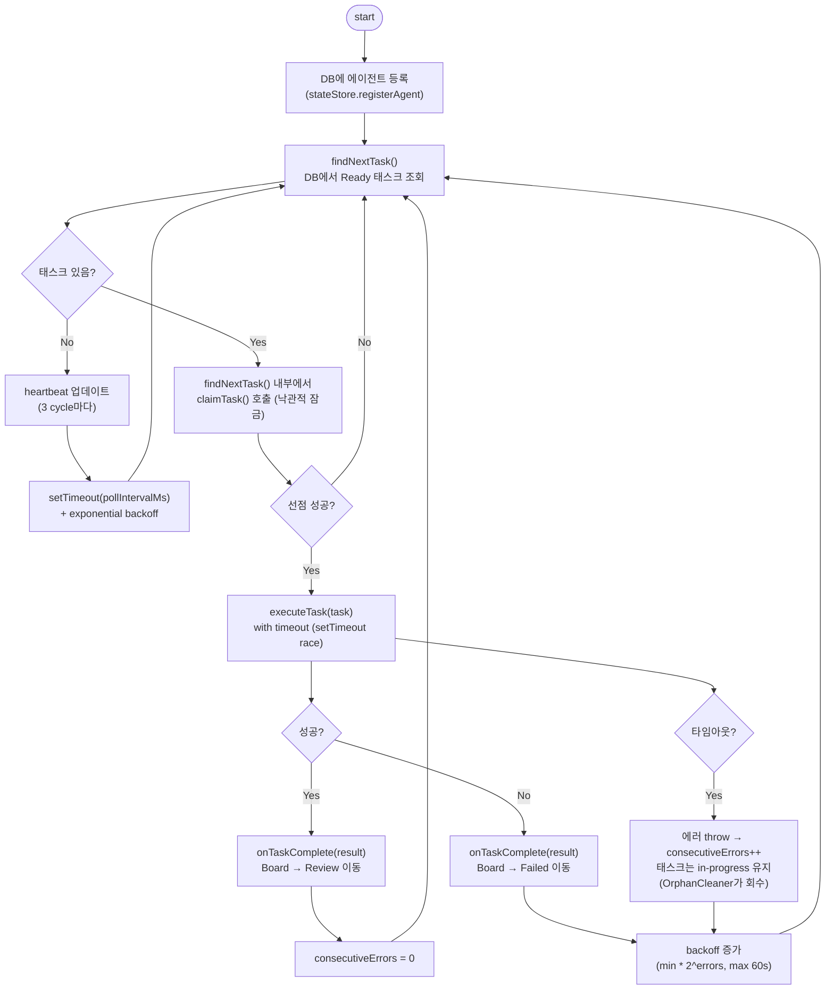
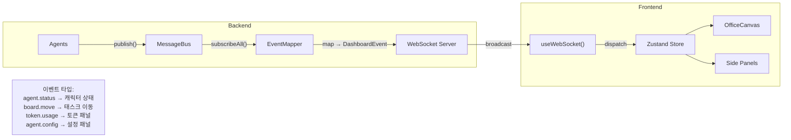
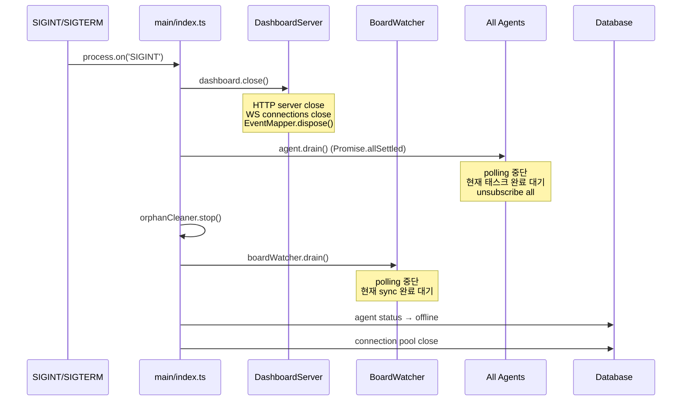

# Workflow Diagrams

## 1. Epic → Task 전체 라이프사이클

```mermaid
sequenceDiagram
    actor User
    participant CLI as CLI / Dashboard
    participant Dir as Director Agent
    participant Board as GitHub Board
    participant BW as BoardWatcher
    participant DB as PostgreSQL
    participant Worker as Worker Agent
    participant Claude as Claude API

    Note over User, Claude: Phase 1 — Epic 생성 & 계획

    User ->> CLI: "쇼핑몰 백엔드 만들어줘"
    CLI ->> Dir: user.input (MessageBus)
    Dir ->> Claude: Epic 분석 프롬프트
    Claude -->> Dir: Epic 계획 + Task 목록

    loop 각 Task마다
        Dir ->> Board: Issue 생성 (label: agent:backend 등)
        Dir ->> DB: Task 레코드 생성 (status=backlog)
    end

    loop 의존성 없는 Task만
        Dir ->> Board: Backlog → Ready 이동
        Dir ->> DB: Task status=ready 업데이트
    end

    Note over User, Claude: Phase 2 — Board 동기화 & Task 선점

    BW ->> Board: GraphQL 폴링 (15초)
    Board -->> BW: 전체 프로젝트 아이템
    BW ->> DB: upsert tasks (status, column 동기화)
    BW ->> DB: board.move 메시지 저장
    BW -->> Dir: board.move (MessageBus broadcast)

    Worker ->> DB: getReadyTasksForAgent(myId)
    DB -->> Worker: Ready 태스크 목록
    Worker ->> DB: claimTask(taskId) — 낙관적 잠금
    DB -->> Worker: true (선점 성공)

    Note over User, Claude: Phase 3 — 코드 생성 & 리뷰

    Worker ->> Claude: 코드 생성 프롬프트
    Claude -->> Worker: GeneratedCode (files[])
    Worker ->> Worker: FileWriter.writeFiles()
    Worker ->> Board: In Progress → Review 이동
    Worker ->> Dir: review.request (MessageBus)

    Dir ->> Claude: 리뷰 프롬프트
    Claude -->> Dir: 리뷰 결과 (approve / request-changes)

    alt Approved
        Dir ->> Board: Review → Done
        Dir ->> DB: task.status = done
    else Changes Requested (retryCount < MAX_RETRIES - 1)
        Dir ->> Board: Review → Ready (재시도)
        Dir ->> DB: task.status = ready, retryCount++
        Dir ->> Worker: review.feedback (MessageBus)
        Worker ->> Worker: 재작업
    else Changes Requested (retryCount >= MAX_RETRIES - 1)
        Dir ->> Board: Review → Failed
        Dir ->> DB: task.status = failed
    end

    Note over User, Claude: Phase 4 — 완료 & 정리

    BW ->> Board: 폴링 — Done 감지
    BW ->> DB: 동기화
    Dir ->> Dir: Epic progress 재계산
    Dir -->> User: epic.progress (Dashboard 표시)
```

## 2. BoardWatcher 동기화 사이클

```mermaid
flowchart TD
    Start([폴링 시작]) --> Fetch["GitService.getAllProjectItems()<br/>(GraphQL 1회)"]
    Fetch --> Loop{각 BoardIssue 순회}

    Loop --> FindTask["DB에서 task 조회<br/>(githubIssueNumber)"]
    FindTask --> Exists{task 존재?}

    Exists -->|No| Create["DB에 task 생성<br/>(boardColumn, labels, assignedAgent)"]
    Create --> Track1["currentColumns.set()<br/>(추적 등록)"]
    Track1 --> Loop
    Exists -->|Yes| Changed{column 변경?}

    Changed -->|No| Track3["currentColumns.set()<br/>(현재 컬럼 유지)"]
    Track3 --> Loop
    Changed -->|Yes| Priority{"신규 status ><br/>현재 status?<br/>또는 failed/done?"}

    Priority -->|Yes| Update["DB 업데이트<br/>(status, boardColumn)"]
    Priority -->|No| Skip["건너뜀<br/>(역행 방지)"]
    Skip --> Track4["currentColumns.set()<br/>(Board 컬럼 추적)"]
    Track4 --> Loop

    Update --> Publish["MessageBus.publish<br/>(board.move)"]
    Publish --> Track2["currentColumns.set()<br/>(추적 갱신)"]
    Track2 --> Loop

    Loop -->|순회 완료| SavePrev["previousColumns 일괄 갱신"]
    SavePrev --> Removed["삭제된 이슈 감지<br/>(previousColumns 비교)"]
    Removed --> Sleep["setTimeout(pollIntervalMs)"]
    Sleep --> Start
```

## 3. Task 상태 머신

```mermaid
stateDiagram-v2
    [*] --> Backlog : Issue 생성

    Backlog --> Ready : Director 승인<br/>(assignedAgent 지정)

    Ready --> InProgress : Worker claimTask()<br/>(낙관적 잠금)

    InProgress --> Review : 코드 생성 완료<br/>(Board 이동)

    Review --> Done : Director approve
    Review --> Ready : Director request-changes<br/>(retryCount < MAX_RETRIES - 1)
    Review --> Failed : Director request-changes<br/>(retryCount >= MAX_RETRIES - 1)

    InProgress --> InProgress : 타임아웃 / 에러<br/>(OrphanCleaner가 회수)

    Done --> [*]
```

## 4. 에이전트 폴링 루프 (BaseAgent)

```mermaid
flowchart TD
    Start([start]) --> Register["DB에 에이전트 등록<br/>(stateStore.registerAgent)"]
    Register --> Poll["findNextTask()<br/>DB에서 Ready 태스크 조회"]

    Poll --> HasTask{태스크 있음?}

    HasTask -->|No| Heartbeat["heartbeat 업데이트<br/>(3 cycle마다)"]
    Heartbeat --> Wait["setTimeout(pollIntervalMs)<br/>+ exponential backoff"]
    Wait --> Poll

    HasTask -->|Yes| Claim["findNextTask() 내부에서<br/>claimTask() 호출 (낙관적 잠금)"]
    Claim --> Won{선점 성공?}

    Won -->|No| Poll
    Won -->|Yes| Execute["executeTask(task)<br/>with timeout (setTimeout race)"]

    Execute --> Result{성공?}

    Result -->|Yes| Complete["onTaskComplete(result)<br/>Board → Review 이동"]
    Complete --> ResetBackoff["consecutiveErrors = 0"]
    ResetBackoff --> Poll

    Result -->|No| ErrorPath["onTaskComplete(result)<br/>Board → Failed 이동"]
    ErrorPath --> IncBackoff["backoff 증가<br/>(min * 2^errors, max 60s)"]
    IncBackoff --> Poll

    Execute --> Timeout{타임아웃?}
    Timeout -->|Yes| TimeoutErr["에러 throw → consecutiveErrors++<br/>태스크는 in-progress 유지<br/>(OrphanCleaner가 회수)"]
    TimeoutErr --> IncBackoff
```

## 5. Dashboard 이벤트 흐름

```mermaid
flowchart LR
    subgraph Backend
        Agent["Agents"]
        MB["MessageBus"]
        EM["EventMapper"]
        WS["WebSocket Server"]
    end

    subgraph Frontend
        Hook["useWebSocket()"]
        Store["Zustand Store"]
        Canvas["OfficeCanvas"]
        Panels["Side Panels"]
    end

    Agent -->|"publish()"| MB
    MB -->|"subscribeAll()"| EM
    EM -->|"map → DashboardEvent"| WS
    WS -->|"broadcast"| Hook
    Hook -->|"dispatch"| Store
    Store --> Canvas & Panels

    Note["이벤트 타입:<br/>agent.status → 캐릭터 상태<br/>board.move → 태스크 이동<br/>token.usage → 토큰 패널<br/>agent.config → 설정 패널"]
```

## 6. Graceful Shutdown 순서

```mermaid
sequenceDiagram
    participant Signal as SIGINT/SIGTERM
    participant Main as main/index.ts
    participant Dash as DashboardServer
    participant BW as BoardWatcher
    participant Agents as All Agents
    participant DB as Database

    Signal ->> Main: process.on('SIGINT')
    Main ->> Dash: dashboard.close()
    Note over Dash: HTTP server close<br/>WS connections close<br/>EventMapper.dispose()
    Main ->> Agents: agent.drain() (Promise.allSettled)
    Note over Agents: polling 중단<br/>현재 태스크 완료 대기<br/>unsubscribe all
    Main ->> Main: orphanCleaner.stop()
    Main ->> BW: boardWatcher.drain()
    Note over BW: polling 중단<br/>현재 sync 완료 대기
    Main ->> DB: agent status → offline
    Main ->> DB: connection pool close
```
