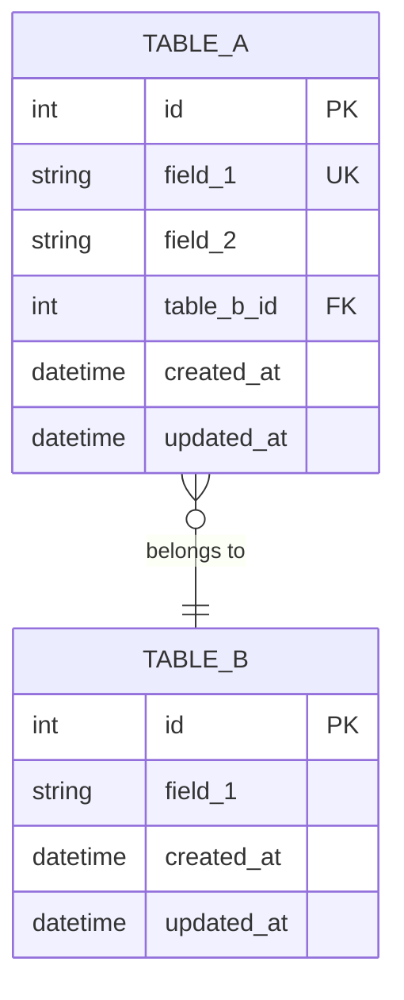

## {{section_number}}. 저장소 / 스키마

### 저장소 타입
<프로젝트에서 사용하는 영속 저장 수단>
- 예: PostgreSQL + 마이그레이션 도구 / SQLite + expo-sqlite / JSON 파일 / Redis / 파일 시스템
- 선택 근거: <왜 이 저장소인가 — /ha-redesign 의 보존/번복 판단 기준>

### ER 다이어그램

> 관계 표기: `||--||` 1:1 / `||--o{` 1:N / `}o--o{` N:M

### 스키마 정의
각 테이블/컬렉션/파일 스키마:

#### `<table_name>`
| 컬럼/필드 | 타입 | Null | 기본값 | 비고 |
|----------|------|:---:|--------|------|
| `<name>` | `<type>` | ❌ | — | PK / UNIQUE / ... |

### 관계
- `<entity_a>.<field>` → `<entity_b>.<field>` (ON DELETE: CASCADE / SET NULL / RESTRICT)

### 인덱스
| 대상 | 컬럼/키 | 이유 |
|------|--------|------|
| `<table>` | `<col>` | <조회 패턴> |

### 마이그레이션 전략
- 도구: `<프로파일별 — 예: Alembic / Drizzle / 수동 SQL / PRAGMA user_version>`
- 정책: `<forward-only vs reversible>`
- 검토 규칙: 자동생성 마이그레이션은 수동 검토 필수

### 파일 저장 (DB 대신 파일 기반일 때)
- 위치: `<경로 — platformdirs.user_data_dir 등 권장>`
- 포맷: `<JSON / TOML / SQLite / CSV / Parquet>`
- 동시성: `<mutex / WAL / 단일 쓰레드 전제>`

### 백업 / 복구 (해당 시)
- 백업 주기
- 복구 절차

> 작성 가이드:
> - 모든 엔티티에 생성/갱신 시각 필드 권장 (`created_at`, `updated_at`)
> - datetime은 타임존 인식 타입 사용
> - ID 타입은 프로젝트 전체 통일 (Integer 또는 UUID 혼용 금지)
> - 외래키 CASCADE 정책 명시 필수
> - 구체 모델 예시 코드는 프로파일 본문 참조 (SQLModel/Drizzle/Prisma 등)
